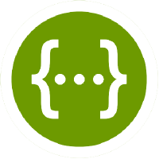
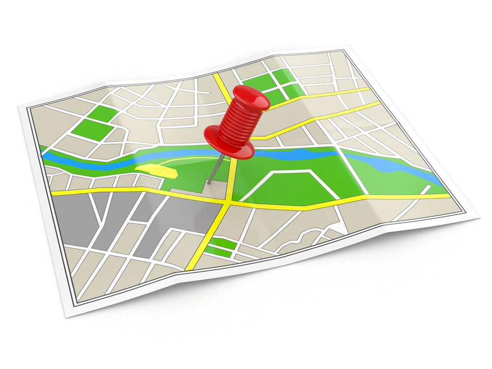
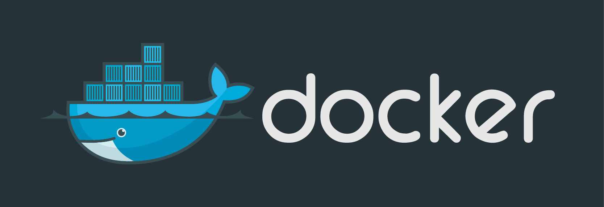
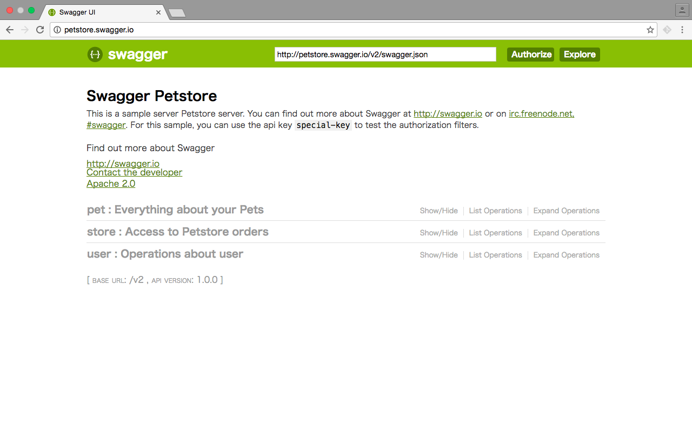
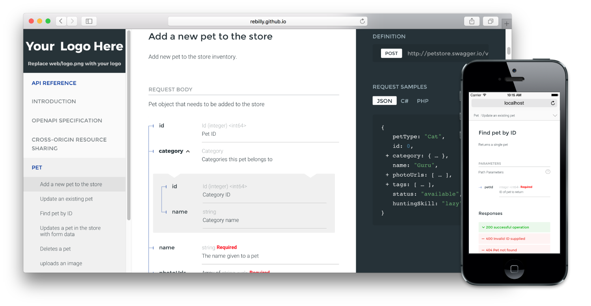

# How I create a Microservice with goa
<!-- .slide: data-transition="fade" -->

\#goadesigntokyo

2016/09/06

---

## Who am I
<!-- .slide: data-transition="fade" -->


@tchssk (Taichi Sasaki)

Engineer at Ebisol, Inc.

---

## Agenda
<!-- .slide: data-transition="fade" -->

- Why I use goa
- How I use goa
- When I contribute to goa

---

## Why I use goa
<!-- .slide: data-transition="fade" -->

- We started to create a new web service.
- The service needs a web API.
- An existing service is using Goji.

    <https://github.com/zenazn/goji>

- I like Goji but writing specification manually is painful.
- I want to use an API Description Language.
    - Swagger, API Blueprint, RAML, etc...

---

### Swagger (OpenAPI)
<!-- .slide: data-transition="fade" -->

The World's Most Popular Framework for APIs.

<http://swagger.io/>



---

### Some generators for Swagger
<!-- .slide: data-transition="fade" -->

- Swagger Codegen
    - It didn't support Go.
- go-swagger
    - It looks unstable.
- goa
    - Beautiful APIs.

I decided to use goa.

---

## How I use goa
<!-- .slide: data-transition="fade" -->

1. Write design
2. Generate codes by goagen
3. Implement controllers

Let me repeat it.

---

### Directories
<!-- .slide: data-transition="fade" -->

```bash
.
├── app
├── client
├── controllers  # 3. Implement controllers
├── db
├── design       # 1. Write design
├── models
├── swagger
└── tool
```

I put controllers into `controllers` directory.

---

#### `design` Directory
<!-- .slide: data-transition="fade" -->

```bash
├── design
│   ├── api_definition.go  # apidsl.API()
│   ├── media_types.go     # apidsl.MediaType()
│   ├── models.go          # dsl.StorageGroup()
│   ├── resources.go       # apidsl.Resource()
│   ├── security.go        # apidsl.JWTSecurity()
│   └── user_types.go      # apidsl.Type()
```

`design` is separated by each top level DSL.

---

### What I use with goa
<!-- .slide: data-transition="fade" -->

- Gorma
- Docker
- Swagger UI

---

### Gorma
<!-- .slide: data-transition="fade" -->

Storage generation plugin for Goa.

<https://github.com/goadesign/gorma>

---

#### What is Gorma
<!-- .slide: data-transition="fade" -->

- Gorma provides a custom DSL for goa.
- It is used to generate Go codes that uses Gorm.
- Gorm is an ORM library for Go.

---

#### How to use Gorma
<!-- .slide: data-transition="fade" -->

1. Write design
2. Generate codes by goagen
3. Use generated codes in controllers

---

##### An example -- Geolocation API
<!-- .slide: data-transition="fade" -->



---

##### 1. Write design
<!-- .slide: data-transition="fade" -->

```go
var sg = StorageGroup("MyStorageGroup", func() {
	Store("mysql", gorma.MySQL, func() {
		Model("Location", func() {
			RendersTo(Location)  // This will generate a helper.
			Field("name", gorma.String)
			Field("latitude", gorma.Decimal)
			Field("longitude", gorma.Decimal)
		})
	})
})
```
---

##### 2. Generate codes by goagen
<!-- .slide: data-transition="fade" -->

```bash
$ goagen gen \
--design=github.com/tchssk/go-study/design \
--pkg-path=github.com/goadesign/gorma
```
goagen generates following code for Gorm

```go
// Location Relational Model
type Location struct {
	ID        int `gorm:"primary_key"`  // This is added by default.
	CreatedAt time.Time                 // This is added by default.
	DeletedAt *time.Time                // This is added by default.
	Latitude  float32
	Longitude float32
	Name      string
	UpdatedAt time.Time                 // This is added by default.
}
```

and some helpers.

---

##### 3. Use generated codes in controllers
<!-- .slide: data-transition="fade" -->

```go
func (c *LocationController) Show(
	ctx *app.ShowLocationContext
) error {
	ldb := models.NewLocationDB(db)  // db is the instance of Gorm.
	location, err := ldb.OneLocation(ctx)       // Helper.
	if err != nil {
		return ctx.NotFound()
	}
	return ctx.OK(location.LocationToLocation)  // Helper.
}
```

These are useful helper methods generated by Gorma.

```go
models.NewLocationDB()
// It creates a new storage type.

ldb.OneLocation()
// It gets one location from database.

location.LocationToLocation()
// It converts location to response media type.
// This is generated from RendersTo().
```

---

### Docker
<!-- .slide: data-transition="fade" -->

The open-source application container engine.

<https://github.com/docker/docker>

Maybe you are more familiar than me.



---

#### What I use docker for
<!-- .slide: data-transition="fade" -->

Creating a contaier of MySQL for

- Local Development	Environment
- Testing

---

##### Local Development Environment
<!-- .slide: data-transition="fade" -->

1. Start a MySQL container.
2. Start a server with connection to the container.

---

##### Testing
<!-- .slide: data-transition="fade" -->

- Use Dockertest.

---

###### Dockertest
<!-- .slide: data-transition="fade" -->

Dockertest library provides easy to use commands for spinning up Docker containers and using them for your tests.

<https://github.com/ory-am/dockertest>

---

###### How I use Dockertest
<!-- .slide: data-transition="fade" -->

In `TestMain()`,

1. Start a container by Dockertest.
2. Create fixtures (test data) in the container.
3. Execute tests.
4. Close DB connection and clean up the container.

---

###### TestMain()
<!-- .slide: data-transition="fade" -->

```go
func TestMain(m *testing.M) {
	c, err := dockertest.ConnectToMySQL(15, time.Second,
		func(url string) bool {
			SetDB(database.GetWithURL(url)) // Open DB connection.
			return true
		},
	)
	if err != nil {
		log.Fatalf("Could not connect to database: %s", err)
	}                 // 1. Start a continer.
	CreateFixtures()  // 2. Create fixtures.
	result := m.Run() // 3. Execute tests.
	db.Close()        // 4. Close DB connection.
	c.KillRemove()    // 4. Clean up the container.
	os.Exit(result)
}
```

---

###### go test
<!-- .slide: data-transition="fade" -->

```bash
$ export DOCKERTEST_MYSQL_IMAGE_NAME=mysql:5.6
$ go test ./...
```

Dockertest provides some envioronment variables.

<https://github.com/ory-am/dockertest#i-need-to-use-a-specific-container-version-for-xyz>

---

###### CI
<!-- .slide: data-transition="fade" -->

Project is built and tested on CircleCI.

Below is `circle.yml`.

```
machine:
  environment:
    DOCKERTEST_BIND_LOCALHOST: true
    DOCKERTEST_MYSQL_IMAGE_NAME: mysql:5.6
  services:
    - docker
```

---

### Swagger UI
<!-- .slide: data-transition="fade" -->

Swagger UI is a dependency-free collection of HTML, Javascript, and CSS assets that dynamically generate beautiful documentation from a Swagger-compliant API.

<https://github.com/swagger-api/swagger-ui>



---

#### How I use Swagger UI
<!-- .slide: data-transition="fade" -->

1. Clone files in `dist` directory of Swagger UI into `swagger` directory of my repository.
2. Fix `index.html` to use `./swagger.json` by default.
3. Update design to serve the files.

    ```go
    var _ = apidsl.Resource("swagger", func() {
    	apidsl.Origin("*", func() {
    		apidsl.Methods("GET")
    	})
    	apidsl.Files("/swagger.json", "swagger/swagger.json")
    	apidsl.Files("/*filepath", "swagger")
    })
    ```

4. Regenerate codes.

---

### ReDoc
<!-- .slide: data-transition="fade" -->

OpenAPI/Swagger-generated API Reference Documentation.

<https://github.com/Rebilly/ReDoc>



---

#### API Console of ReDoc
<!-- .slide: data-transition="fade" -->

[API Console feature · Issue #53 · Rebilly/ReDoc](https://github.com/Rebilly/ReDoc/issues/53)

Coming soon?

---

## When I contribute to Goa
<!-- .slide: data-transition="fade" -->

I find some typo or bugs

- when I regenerate codes by latest goagen.
- when I use API never used before.
- when I receive unexpected errors.

Then I dive into goa and explore that.

---

### Inside of goa
<!-- .slide: data-transition="fade" -->

- It is very helpful to study Go.
- I'm getting good at the mechanism of goa.
- I send a pull request when I finish to fix something.

---

### Contribution is welcomed
<!-- .slide: data-transition="fade" -->

- I'm not super programmer.
- ~~My contributions are almost fixing typo~~ but I'm thanked by commiter.
- Continual contibutions make the software better.

---

Would you like to use goa?

and contribute to that?
<!-- .slide: data-transition="fade" -->
